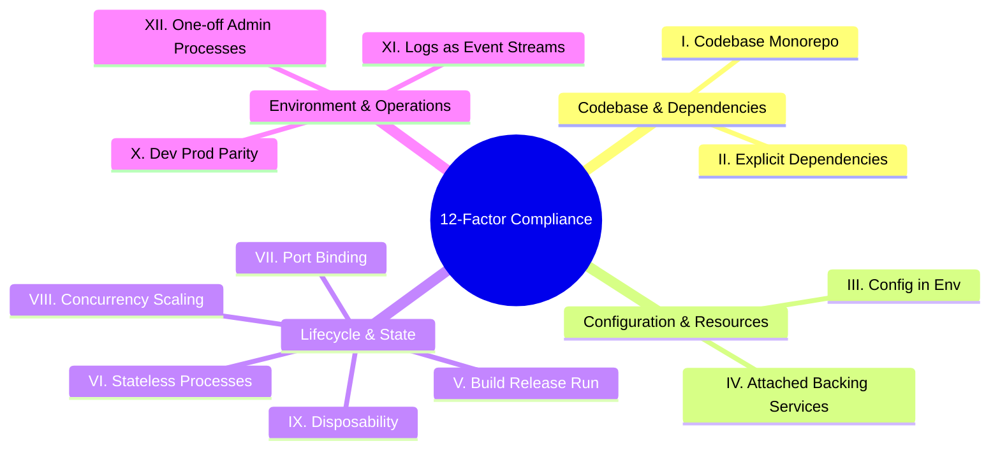

# Stagea Platform: 12-Factor App Compliance Blueprint

This document defines how the entire Stagea community platform—including the in-house Astro Shell, the submoduled services (NodeBB, MediaWiki, Ghost, Saleor), and planned components (Keycloak, Directus)—aligns with the twelve principles of [12factor.net](https://12factor.net).

---



---

## I. Codebase
> **One codebase tracked in revision control, many deploys.**

### Implementation in Stagea
1. **Single Repository Model**: The `stagea-stuff` repository is a unified monorepo containing all platform-specific code, environment contracts, orchestration definitions, and system documentation.
2. **Submodule Integration**: Upstream applications (NodeBB forum, MediaWiki, Ghost blog, Saleor storefront) are tracked as Git submodules pinned to specific, deterministic SHA commits. They are not checked in as raw code, preserving clean upstream separation while ensuring the entire monorepo remains a single source of truth.
3. **Continuous Deployment Mapping**: 
   * A single codebase is built into identical container artifacts and deployed across multiple environments (local development, staging `*.stagea-stuff.dev`, and production `*.stagea-stuff.com`).
   * Parity is maintained because there is only one codebase, and no code branching is used to differentiate environments.

---

## II. Dependencies
> **Explicitly declare and isolate dependencies.**

### Implementation in Stagea
1. **Zero System Assumptions**: No platform service relies on the implicit existence of system-level packages on the host machine. All runtime environments are fully self-contained.
2. **Explicit Language Package Managers**:
   * **Astro Shell (`shell/`)**: Uses `pnpm` with `pnpm-lock.yaml` and strict engine bounds (`"node": ">=20.10.0"`).
   * **Ghost Blog (`blog/`)**: Uses `pnpm` monorepo workspaces and Nx for dependency isolating.
   * **MediaWiki (`wiki/`)**: Isolates PHP dependencies using Composer (`composer.json`).
3. **Isolation via Containerization**: Production builds occur in multi-stage Docker environments (e.g. `node:22-alpine` or `php:8.1-apache`). Dependencies are fetched during the build stage using pinned locks and isolated from the host operating system, preventing "works on my machine" class failures.

---

## III. Config
> **Store config in the environment.**

### Implementation in Stagea
1. **Strict Separation of Config and Code**: Absolutely no database credentials, API secrets, SMTP keys, or internal routing URLs are hardcoded in any Stagea service codebase.
2. **Astro Env Schema**: The Astro Shell defines its environmental contract in `shell/astro.config.mjs` using strict typing. Variable values are read from the OS environment at request-time:
   ```javascript
   env: {
     schema: {
       FORUM_URL: envField.string({ context: "server", access: "public", default: "http://localhost:4567/" }),
       AUTH_ISSUER_URL: envField.string({ context: "server", access: "secret", optional: true }),
     }
   }
   ```
3. **Environment-Specific Overrides**:
   * **Local Dev**: Handled automatically via container port exports and local `.env` values or Astro config defaults.
   * **Staging & Prod**: Injected via Docker Compose `environment:` maps, Kubernetes ConfigMaps, or cloud container definitions without rebuilding the underlying images.

---

## IV. Backing Services
> **Treat backing services as attached resources.**

### Implementation in Stagea
1. **Dynamic Resource Binding**: All databases (Postgres, MongoDB, Redis) and services (Keycloak IdP, Search API) are treated as attached network resources. The applications consume them over local or remote network connections.
2. **Loose Coupling**: Services are agnostic about where their backing databases reside. 
   * In local development, the NodeBB forum connects to a containerized Redis instance running on `localhost:6379`.
   * In production, the environment variable `REDIS_URL` is changed to point to a managed AWS ElastiCache cluster.
   * The application code is unchanged, ensuring that swapping a local resource for a third-party or cloud-managed service is purely a configuration update.

---

## V. Build, Release, Run
> **Strictly separate build and run stages.**

### Implementation in Stagea
We enforce a strict separation between turning source code into a running system across three distinct stages:

```
[ Code Commit ]
      │
      ▼
┌──────────────┐
│ 1. BUILD     │  --> Compiles code, fetches isolated deps, runs assets pipeline
└──────┬───────┘      Produces immutable container images (e.g., stagea-shell:v1.0.0)
      │
      ▼
┌──────────────┐
│ 2. RELEASE   │  --> Combines the immutable image with target environment config
└──────┬───────┘      Generates a specific release definition (Config + Build)
      │
      ▼
┌──────────────┐
│ 3. RUN       │  --> Launches the release in the execution environment
└──────────────┘      Launches the stateless container instance
```

1. **Build**: Triggered on code changes (e.g., in CI/CD). It runs `pnpm build` or `composer install` inside isolated builder containers. It produces immutable image tags (e.g., `stagea-shell:v1.2.0`). Assets cannot be modified once built.
2. **Release**: Combines the built image with the target environment's specific configuration. (For example, merging `stagea-shell:v1.2.0` with the Staging Config Map). The release is given an immutable release ID, enabling safe rollbacks.
3. **Run**: Launches the process inside the host environment. The run stage is kept as simple and stateless as possible, preventing runtime execution drift.

---

## VI. Processes
> **Execute the app as one or more stateless processes.**

### Implementation in Stagea
1. **Share-Nothing Architecture**: All Stagea applications are executed as stateless, share-nothing processes. No request-level state or session information is stored on the local container's disk.
2. **Externalized Persistence**:
   * **Session Data**: OIDC session states are maintained either inside secure client-side cookies or in external fast-cache clusters (Redis).
   * **Assets & Media**: User-uploaded wiki images, shop product thumbnails, or forum attachments are persisted in shared object storage (such as AWS S3 or MinIO) rather than the local filesystem.
3. **Disposability-Safe**: Any running container can be instantly killed and replaced by a new instance without losing user data or terminating transactions.

---

## VII. Port Binding
> **Export services via port binding.**

### Implementation in Stagea
1. **Self-Contained Servers**: None of our services rely on injection into an existing web server (like a pre-configured Apache or Tomcat installation). Each service is self-contained and binds directly to an internal port:
   * **Astro Shell**: Binds to `4321` (Node.js engine)
   * **NodeBB Forum**: Binds to `4567` (Express web server)
   * **MediaWiki**: Binds to `80` (Built-in Apache/PHP process)
   * **Ghost Blog**: Binds to `2368` (Node.js service)
   * **Keycloak**: Binds to `8080` (WildFly/Quarkus Java engine)
2. **Edge Routing**: Inside Docker networks, containers speak to each other directly via their bound ports. Public-facing traffic is received by our edge proxy (e.g. Nginx on `80`/`443`) and routed to the corresponding port-bound service container based on host headers (subdomains).

---

## VIII. Concurrency
> **Scale out via the process model.**

### Implementation in Stagea
1. **Process-Type Categorization**: We scale our services by assigning workloads to specific, stateless process types:
   * **Web Process**: Handles incoming HTTP requests (Astro Shell, Ghost Web).
   * **Worker Process**: Handles background queues, mail queues, or index syncs (Ghost/NodeBB task queues).
   * **Database Process**: Handles persistent storage (Postgres, Mongo, Redis).
2. **Horizontal Scaling**: To handle higher loads, we run additional instances of stateless web or worker processes (containers) behind our load balancer rather than attempting to scale vertically by running a single, resource-heavy monolithic thread.

---

## IX. Disposability
> **Maximize robustness with fast startup and graceful shutdown.**

### Implementation in Stagea
1. **Fast Startup**: Containers utilize lightweight base operating systems (Alpine Linux) and pre-optimized assets to minimize the time between starting a container and being ready to receive requests.
2. **Graceful Shutdown (SIGTERM)**:
   * When a container receives a `SIGTERM` from the orchestrator (e.g. Docker, Kubernetes), the process stops accepting new connections, finishes processing any active in-flight HTTP requests, closes active database pools cleanly, and shuts down.
3. **Robustness Against Crashes**: In the event of a sudden crash, transactions are kept safe because all critical state is externalized in transactional databases. The orchestrator automatically and immediately spins up a clean, stateless replacement container.

---

## X. Dev/Prod Parity
> **Keep development, staging, and production as similar as possible.**

### Implementation in Stagea
We bridge the three primary dev/prod gaps identified by the 12-factor methodology:

* **The Time Gap**: Code is continuously built and deployed in hours or minutes (using CI/CD automated test suites and container deployments) rather than weeks or months.
* **The People Gap**: The developers who write the code are the ones who author the Dockerfiles, Compose files, and deployment scripts (using the `stagea-stuff` repo structure).
* **The Tool Gap**:
  * We run the **exact same backing services** in development and production. No mock databases are used.
  * Local development runs real instances of PostgreSQL, MongoDB, Redis, and Keycloak in Docker containers, matching the production cloud stack.
  * Local dev and staging use the identical compiled container images, changing only target environment variables.

---

## XI. Logs
> **Treat logs as event streams.**

### Implementation in Stagea
1. **Zero Log File Management**: No Stagea service is responsible for writing to, rotating, or managing log files on disk (e.g., writing to `/var/log/app.log`).
2. **Stdout/Stderr Streaming**: All processes write their execution logs directly to the standard output (`stdout`) and standard error (`stderr`) streams.
3. **Environment-Specific Routing**:
   * **Local Dev**: Logs are printed directly in the terminal where developers can watch them in real-time.
   * **Staging & Prod**: The container runtime captures these streams and forwards them to a centralized log-aggregation framework (e.g., Docker logging daemon, Loki, Elasticsearch, AWS CloudWatch) for archiving, querying, and monitoring.

---

## XII. Admin Processes
> **Run admin/management tasks as one-off processes.**

### Implementation in Stagea
1. **Identical Environments**: All administrative, management, or maintenance tasks (database migrations, schema imports, user creations) are run in the exact same environment as long-running application processes. They run against the exact same release build and configuration.
2. **One-Off Execution Model**: 
   * Database migrations are executed as one-off tasks (e.g., running `pnpm db:migrate` or running a transient initialization container) rather than being part of the primary web server startup sequence.
   * NodeBB CLI management is run through one-off container executions: `docker exec -it stagea-forum ./nodebb reset ...`.
3. **Scripted Automations**: Admin scripts are checked into the Git repository and built into the container images to ensure they remain version-controlled and identical to the application code.

---

## 🔗 Related Documentation & Compliance References

* 🧭 **[Platform Master Site-Plan](./site-plan.md)** — Overall multi-site architecture, subdomain map, and current monorepo statuses.
* 🐳 **[Shell 12-Factor Implementation Plan](./shell/12_FACTOR_PLAN.md)** — Shell-specific 12-factor operations audit and improvement goals.
* 🚦 **[Shell Quality Readiness Ratings](./shell/READINESS_RATING.md)** — Per-file quality assessments, typescript audits, and production path for the Astro Shell.
* 🔐 **[Shell Scoped Auth Plan](./shell/auth_plan.md)** — Centralized authentication, Keycloak clients, and role hierarchy mappings.
* 📋 **[Shell Sprint Backlog & TODO](./shell/TODO.md)** — Active product features backlog and our 6-step vertical loop checklist.
