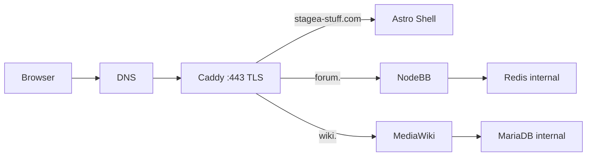
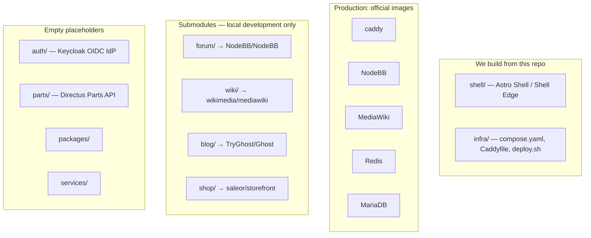

# Stagea Architecture

Visibility-first map of what runs, what we build, and what is still empty.
Product decisions (hosts, licensing, identity choice) stay in
**[site-plan.md](./site-plan.md)** — this file is the picture people open first.

From-zero clone vs go-live: **[install-guides.md](./install-guides.md)**.
Glossary: **Astro Shell** / **Shell Edge**, **Keycloak OIDC IdP**, **Submodules**,
**Directus Parts API** — [DOCUMENTATION_GUIDE.md](./DOCUMENTATION_GUIDE.md).

---

## Remaining gaps

These are **not** implemented. Do not assume they exist because a later-phase
plan or env placeholder mentions them.

| Gap | Reality today |
| :--- | :--- |
| Backups | Slice 7 is a plan only. No `infra/backup.sh`, no `infra/restore.sh`, no nightly encrypted offsite dump. Named volumes persist on the VPS; that is not a backup. |
| GHCR / image supply chain | Slice 8 in repo. `deploy.yml` publishes `ghcr.io/heff0/stagea-shell` (`:<sha>` + `:main`). Compose uses `${SHELL_IMAGE}`; `build:` remains a host fallback. [ci-cd.md](./deployment/ci-cd.md). First merge still needs the GHCR package made public. |
| Scaling after go-live | Decision record: [scaling_plan.md](./deployment/scaling_plan.md). Stay on Compose through 1,000 users unless RAM/disk inequalities fire. |
| **Keycloak OIDC IdP** | `auth/` and `services/auth/` are empty. Phase 3 / slice 11. `AUTH_*` keys in `infra/.env.example` are placeholders so Compose can start — they do not start an IdP. |
| **Directus Parts API** | `parts/` and `services/parts-api/` are empty. Phase 3. |
| Blog in production | Ghost is a local **Submodule** only. Not in `infra/compose.yaml`. Phase 2 / slice 9. |
| Shop in production | Storefront is a local **Submodule** only. No Saleor backend in this repo. Phase 3 / slice 11. |
| Observability | Slice 10 not started. Phase 1 healthchecks exist; no uptime probe or disk alert. |
| Independent Shell deploys | Implemented: `./infra/deploy.sh --module shell` and path-filtered `deploy.yml`. Default `./infra/deploy.sh` is still full-stack. [ci-cd.md](./deployment/ci-cd.md). |
| Submodule SHAs in site-plan §2 | May lag gitlinks after Dependabot bumps. Trust `git submodule status`. |
| Target monorepo (`apps/`, `packages/`, Turbo) | Not scaffolded. Current tree is `shell/` + **Submodules** + `infra/` + empty placeholders. |
| Repo-level LICENSE | Stagea glue (docs, `infra/`, `shell/`) has no root license file yet. |

---

## Production request path (Phase 1)

Only Caddy binds host ports `80` and `443`. Redis and MariaDB have no public
hostname. Image pins, named volumes, and later-phase rows:
[production_plan.md §3](./deployment/production_plan.md#3-service-map)
(do not copy that table here).

`www.stagea-stuff.com` and `app.stagea-stuff.com` are Caddy permanent redirects
to the apex. They are not application processes.

Operator how: [GO_LIVE.md](./deployment/GO_LIVE.md). After initial setup:
`./infra/deploy.sh`.

---

## Monorepo: what we build vs what we pull

Production **does not** clone **Submodules**. `forum/` and `wiki/` on the VPS
stay unpopulated; Compose pulls `ghcr.io/nodebb/nodebb` and `mediawiki`.
`blog/` and `shop/` are the same rule once those phases land.

Local development **does** clone **Submodules**. Install index:
[install-guides.md](./install-guides.md).

`infra/homepage/` is a local-dev hub (`localhost:8090`). It is not on the
production request path.

---

## Module independence

**Requirement:** a deploy of the **Astro Shell** must not restart forum or wiki
(or their Redis / MariaDB). Those processes hold user-generated state; bouncing
them for a Shell image rebuild is an availability bug.

Default `./infra/deploy.sh` still reconciles the whole file (first-run / dispatch
`module=all`). Routine Shell changes use `--module shell` (`up -d --no-deps
shell`) from [deploy.yml](../.github/workflows/deploy.yml) so forum and wiki
stay up. See [ci-cd.md](./deployment/ci-cd.md).

---

## Live vs planned

Do not copy the subdomain table. **[site-plan.md §2](./site-plan.md#2-subdomain-map)**
is SSOT.

Short status:

* **Live in Phase 1 Compose:** apex **Astro Shell**, `forum.` NodeBB + Redis,
  `wiki.` MediaWiki + MariaDB, Caddy TLS, `www`/`app` redirects.
* **In the repo, not in production Compose:** Ghost (`blog/`), Saleor storefront
  (`shop/`) — local **Submodules** only.
* **Planned, directories empty:** **Keycloak OIDC IdP**, **Directus Parts API**.
* **Phased later:** blog (slice 9), observability (slice 10), identity and
  commerce (slice 11). Ordered list: [production_plan.md §7](./deployment/production_plan.md#7-vertical-slices).

---

## Identity

Single sign-on is **deferred**. The **Keycloak OIDC IdP** is the chosen provider
([site-plan.md §3](./site-plan.md#3-identity-layer)) and is **not running**.
No realm, no clients, no federation.

Phase 1 services use their own first-run admin wizards (NodeBB, MediaWiki).
Do not point operators at `auth.stagea-stuff.com` as if it exists.

---

## Secrets, volumes, and TLS

| What | Where it lives |
| :--- | :--- |
| Production secrets | `infra/.env` on the host (`chmod 600`, gitignored). Inventory: `infra/.env.example`. Copy from a password manager; never commit. |
| TLS | Caddy obtains Let's Encrypt certs. Material persists in the `caddy_data` named volume. Do not delete that volume. |
| Application state | Compose named volumes (`forum_data`, `forum_uploads`, `forum_redis_data`, `wiki_images`, `wiki_config`, `wiki_db_data`, `caddy_config`). Full list and backup *intent*: [production_plan.md §3](./deployment/production_plan.md#3-service-map) and [§8](./deployment/production_plan.md#8-backup-and-restore-minimum). |
| Wiki `LocalSettings.php` | Not in git. Persisted in `wiki_config` via [GO_LIVE.md §5.2](./deployment/GO_LIVE.md#52-mediawiki). |

Never `docker compose down -v` — `-v` deletes those volumes.

---

## Related

* [From-Zero Install Guides](./install-guides.md)
* [System-Wide 12-Factor Compliance](./12_factor_compliance.md)
* [Executive Architecture & Quality Report](./EXECUTIVE_AUDIT_REPORT.md)
* [Production Deployment Plan](./deployment/production_plan.md)
* [Scaling Plan](./deployment/scaling_plan.md)
* [Production Spin-Up Runbook](./deployment/GO_LIVE.md)
* [Platform Master Site-Plan](./site-plan.md)
* [Documentation Guide](./DOCUMENTATION_GUIDE.md)
