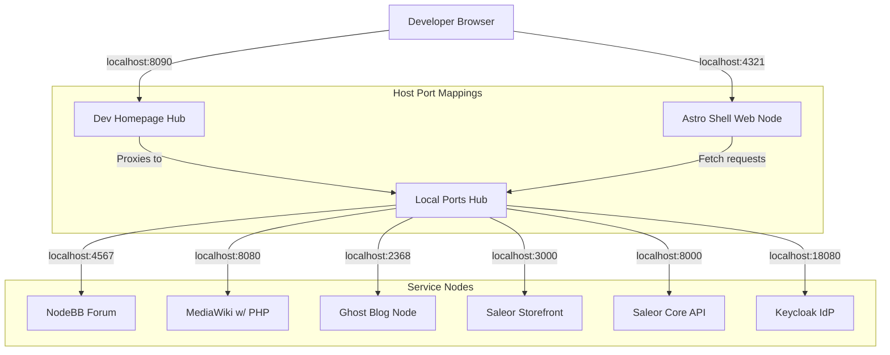

# Stagea Platform: Development Stack Deployment Guide

This document is the master entry point for deploying, orchestrating, and operating the Stagea platform development stack. It details how the Astro Shell, sub-sites, and backing services communicate locally, outlines our port binding specifications, and provides resolution protocols for global stack routing.

---

## 0. Local Development vs Production — Read This First

The Stagea platform has **two distinct deployment targets**, and they share almost no operational details. Confirm which one you are working on before following any instructions below.

| | Local Development (this document) | Production (`stagea-stuff.com`) |
| :--- | :--- | :--- |
| **Host** | Your workstation | One Linux VPS (Ubuntu 24.04) |
| **Edge** | None — direct host port bindings | Caddy on `80`/`443`, automatic TLS |
| **Access** | `localhost:<port>` per service, see the host matrix in §2 | Public subdomains only; no other ports exposed |
| **Orchestration** | Per-app compose files, started individually | One `infra/compose.yaml` for the whole stack |
| **Image source** | Built or run from **Submodules** and local source | Official upstream images; only the Astro Shell is built from this repo |
| **Startup** | Multi-step, per service (see §3) | One command: `./infra/deploy.sh` |
| **Data** | Disposable | Named volumes with nightly encrypted offsite backups |
| **Operator runbook** | This document | **[GO_LIVE.md](./GO_LIVE.md)** — copy-paste spin-up |

**Everything below this section describes local development only.** Do not use the host port matrix, the launch sequence, or the troubleshooting steps in this guide as a production reference.

➡️ For production **how** (DNS, host harden, `./infra/deploy.sh`, first-run wizards, verify) see the **[Production Spin-Up Runbook](./GO_LIVE.md)**. For **why / what** (platform decision, service map, slices, backup/restore) see the **[Production Deployment Plan](./production_plan.md)**.

---

## 1. Development Architecture & Network Topology

In local development, the platform replicates our target 12-factor production environment using Docker container boundaries and explicit port-binding proxies:



---

## 2. Port Binding Directory (Host Matrix)

To prevent port conflicts (such as Ghost and Saleor both trying to claim default Redis port `6379` or default SMTP port `1025`), we strictly segment local host bindings:

| Service | Protocol / Access | Bound Host Port | Internal Port | Configuration Reference |
| :--- | :--- | :--- | :--- | :--- |
| **Astro Shell** | HTTP (SSR Web) | `4321` | `4321` | `shell/astro.config.mjs` |
| **Dev Homepage** | HTTP (Nginx Hub) | `8090` | `80` | `infra/homepage/` |
| **NodeBB Forum** | HTTP (Express) | `4567` | `4567` | `forum/config.json` |
| **MediaWiki** | HTTP (PHP/Apache) | `8080` | `80` | `wiki/docker-compose.yml` |
| **Ghost Web** | HTTP (Express) | `2368` | `2368` | `blog/compose.dev.yaml` |
| **Ghost Mailpit SMTP** | SMTP | `11025` | `1025` | `infra/blog.override.yaml` |
| **Ghost Mailpit Web** | HTTP (Mail UI) | `18025` | `8025` | `infra/blog.override.yaml` |
| **Next.js Shop** | HTTP (Next.js) | `3000` | `3000` | `shop/.env` |
| **Saleor GraphQL** | HTTP (Python Core) | `8000` | `8000` | external container |
| **Keycloak IdP** | HTTP (Java Core) | `18080` | `8080` | `services/auth/` |
| **Directus Parts** | HTTP (Node API) | `8055` | `8055` | `services/parts-api/` |

---

## 3. Launching the Local Stack (Step-by-Step)

To launch a complete Stagea developer environment, execute the services in this sequence:

### Step 1: Start the Local Dev Homepage Gateway
Brings up the static Nginx hub at [http://localhost:8090/](http://localhost:8090/) linking all running dashboards:
```bash
cd infra/homepage
docker compose up -d
```

### Step 2: Start the Astro Shell
Launches our Edge controller at [http://localhost:4321/](http://localhost:4321/):
```bash
cd shell
pnpm install
pnpm dev
```

### Step 3: Start the Sub-Apps
Refer to [Services Setup Guide](./services_setup.md) for individual dependency boot commands (NodeBB, MediaWiki, Ghost, Saleor).

---

## 4. Stack-Wide Debugging & Troubleshooting

### Problem 1: Port Allocation Collisions (`bind: address already in use`)
* **Symptom**: Docker container fails to start, logging: `listen tcp 0.0.0.0:6379: bind: address already in use`.
* **Cause**: A local instance of Redis, MySQL, or Postgres is running natively on your host machine outside Docker, blocking the container from claiming the port.
* **Resolution**:
  1. Identify the blocking process ID (PID):
     ```bash
     # macOS / Linux:
     sudo lsof -i :6379
     ```
  2. Kill the conflicting host process:
     ```bash
     sudo kill -9 <PID>
     # Or stop native services (macOS homebrew):
     brew services stop redis
     ```

### Problem 2: Docker Network DNS Failures (`getaddrinfo ENOTFOUND`)
* **Symptom**: Astro Shell or Ghost fails to fetch internal microservices, throwing DNS resolution errors.
* **Cause**: Containers are not joined to the same Docker bridge network, meaning they cannot resolve each other using service names (e.g., `http://keycloak:8080`).
* **Resolution**:
  1. Verify the active docker networks:
     ```bash
     docker network ls
     ```
  2. Ensure your `compose` files declare a shared external bridge network (e.g. `stagea-net`):
     ```yaml
     networks:
       default:
         name: stagea-net
         external: true
     ```

### Problem 3: Browser Cookie Rejection (Session Expirations)
* **Symptom**: User logs in but is immediately logged out or fails authentication when navigating between subdomains.
* **Cause**: In local development, cookies set on `localhost` cannot be shared with subdomains (like `forum.localhost`) if `SameSite` or `Domain` parameters are misconfigured.
* **Resolution**:
  * For local testing, access services via explicit IP `127.0.0.1` rather than `localhost` if testing subdomain-cookie scopes, or ensure your local OIDC cookies omit the `Domain` restriction to allow standard same-host loopbacks.

---

## 🔗 Related Documentation & Compliance References

* 🧭 **[Platform Master Site-Plan](../site-plan.md)** — Overall multi-site architecture, subdomain map, and current monorepo statuses.
* ⭐️ **[System 12-Factor Compliance Audit](../12_factor_compliance.md)** — Comprehensive review of Stagea monorepo compliance with all twelve principles from 12factor.net.
* 🐳 **[Shell 12-Factor Implementation Plan](../shell/12_FACTOR_PLAN.md)** — Shell-specific 12-factor operations audit and improvement goals.
* 🛠 **[Per-Service Setup Guide](./services_setup.md)** — Step-by-step initial deployment and troubleshooting for each submodule.
* 🚀 **[Production Spin-Up Runbook](./GO_LIVE.md)** — Operator copy-paste guide to bring `stagea-stuff.com` online (initial setup, `./infra/deploy.sh`, wizards, verify).
* 🌍 **[Production Deployment Plan](./production_plan.md)** — How `stagea-stuff.com` goes live: VPS + Docker Compose + Caddy, phased service map, one-command deploy contract, and backup/restore.
* 📋 **[Production Go-Live Sprint Cards](./cards/README.md)** — Vertical-slice cards for Phase 1 (slices 01–06) and deferred Phase 2–3 work.
* 🐳 **[Shell Production Deployment Guide](./shell_deployment.md)** — In-depth guide to deploying the Astro Shell in staging and production (Nginx proxy, TLS, SIGTERM handlers).
