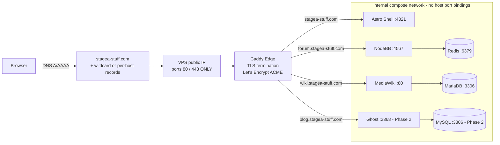

# Stagea Platform: Production Deployment Plan

This document is the production counterpart to the [Development Stack Deployment Guide](./README.md). It defines how `stagea-stuff.com` goes live on real hardware, which images we run, in what order we build the stack, and what the single production spin-up command is.

**Scope**: production only. Nothing in here describes local development — see [`README.md`](./README.md) for the local host port matrix and troubleshooting protocols.

**Status**: plan of record. No Compose file, Caddyfile, or deployment workflow exists in the repository yet. This document is the specification an implementation pass will build against.

---

## 1. Platform Decision

**We deploy to one Linux VPS running Docker Compose behind Caddy.**

The whole production platform is a single `compose.yaml` in `infra/`, a single Caddy container terminating TLS on ports `80` and `443`, and every application container reachable only on an internal Compose network. Nothing else is exposed to the internet.

This is chosen deliberately as the *simplest platform-agnostic pattern* that still satisfies the site-plan's Docker-first and subdomain-per-service goals. It runs identically on Hetzner, DigitalOcean, Vultr, Linode, OVH, or a box under a desk. There is no provider-specific control plane, no proprietary manifest format, and no vendor lock-in to unwind later.

### Alternatives Considered and Rejected

| Alternative | One-line reason for rejection |
| :--- | :--- |
| **Kubernetes (k3s, EKS, GKE)** | Control-plane and manifest overhead vastly exceeds the operational needs of six containers on one host. |
| **Per-app PaaS (Render, Railway, Fly.io, Vercel)** | Each service would need its own provider account, billing, and deploy config — the opposite of a one-command deploy, and MediaWiki/NodeBB are poor PaaS fits. |
| **SaaS mashup (Ghost Pro + hosted forum + hosted wiki)** | Cheapest to start, but forfeits shared identity, shared backups, and a single deploy artifact; migrating off later is a rewrite. |
| **Docker Swarm** | Multi-node orchestration we do not need, on a maintenance-mode project, for zero benefit at one host. |
| **Bare-metal systemd services (no containers)** | Directly contradicts the Docker-first goal in [`site-plan.md`](../site-plan.md) and makes MediaWiki/PHP and NodeBB/Node dependency management a per-host problem. |

### Why Caddy, not nginx, on day 1

Caddy provisions and renews Let's Encrypt certificates automatically with no certbot cron, no ACME challenge wiring, and roughly five lines of config per subdomain. That removes the single largest source of first-deploy failure.

The nginx specification in [`shell_deployment.md`](./shell_deployment.md) — upstream pools, explicit TLS cipher suites, gzip tuning, manual `X-Forwarded-*` headers — remains valid and useful, but it describes a **later hardening or multi-node scale-out step, not the day-1 edge**. Caddy sets the `X-Forwarded-*` headers that document calls out as critical by default. Treat that file as the reference for what the edge must guarantee, and Caddy as the day-1 implementation of those guarantees.

---

## 2. Target: One-Command Production Spin-Up

The goal is a hard split between **one-time host setup** (done by a human, once, with secrets) and **routine deployment** (one command, repeatable, no thinking).

### What "initial setup" is (one-time, manual, per host)

Performed once when a new VPS is provisioned. Never repeated during normal operation.

1. Provision the VPS and harden SSH (key-only auth, no root password login, UFW allowing `22`, `80`, `443`).
2. Install Docker Engine and the Compose plugin.
3. Point DNS records at the host's public IP.
4. Clone this repository to the host.
5. Author `infra/.env` from `infra/.env.example` with real secrets.
6. Create the object-storage bucket and restic/borg repository credentials for backups.
7. First-run application bootstrap that only a human can do: create the NodeBB admin, run the MediaWiki installer to generate `LocalSettings.php`, create the Ghost owner account.

### What the one command does (every time, forever)

1. Pulls upstream images at their pinned tags.
2. Pulls or builds the Astro Shell image.
3. Starts or reconciles every service on the internal network.
4. Starts Caddy, which obtains or renews TLS certificates automatically.
5. Waits for health checks and reports the result.

Everything in that list is idempotent. Running it against an already-healthy stack changes nothing.

---

## 3. Service Map

Phase 1 is the go-live target. Phase 2 and Phase 3 are additive — they add services to the same Compose file and the same Caddyfile without restructuring anything.

| Public host | Service | Production image source | Build from this repo? | Phase | Named volumes |
| :--- | :--- | :--- | :--- | :--- | :--- |
| `stagea-stuff.com` (apex) | Astro Shell | `shell/Dockerfile` in this repo | **Yes** — the only one | 1 | none (stateless) |
| `www.stagea-stuff.com` | redirect → apex | Caddy | n/a | 1 | none |
| `forum.stagea-stuff.com` | NodeBB | official `nodebb/docker` image | No | 1 | `forum_data`, `forum_uploads` |
| *(internal)* | NodeBB Redis | official `redis` image | No | 1 | `forum_redis_data` |
| `wiki.stagea-stuff.com` | MediaWiki | official `mediawiki` image | No | 1 | `wiki_images`, `wiki_config` |
| *(internal)* | MediaWiki MariaDB | official `mariadb` image | No | 1 | `wiki_db_data` |
| *(edge)* | Caddy | official `caddy` image | No | 1 | `caddy_data`, `caddy_config` |
| `blog.stagea-stuff.com` | Ghost | official `ghost` image | No | 2 | `blog_content` |
| *(internal)* | Ghost MySQL | official `mysql` image | No | 2 | `blog_db_data` |
| `shop.stagea-stuff.com` | Saleor Storefront | storefront image + external Saleor GraphQL API | No | 3 | none (state lives in Saleor) |
| `auth.stagea-stuff.com` | Keycloak OIDC IdP | official `keycloak` image | No | 3 | `auth_db_data` |
| `parts.stagea-stuff.com` | Directus Parts API | official `directus` image | No | 3 | `parts_db_data`, `parts_uploads` |

The canonical subdomain-to-service mapping and each service's repository status live in the [Platform Master Site-Plan](../site-plan.md#2-subdomain-map). This table adds only the deployment-specific columns: image provenance, phase, and persistent state.

### The Submodules are not built in production

`forum/`, `wiki/`, `blog/`, and `shop/` are **Submodules** pinned to upstream source. Their presence in the repository is for reading upstream code, tracking pinned revisions, and local development. Production runs the *official published images* for those projects. Only the Astro Shell — code we actually wrote — is built from this repository. This keeps deploys fast, keeps us on upstream security patches, and means a submodule pointer bump never breaks production.

### Open question: apex vs `app.` for the Astro Shell

[`site-plan.md`](../site-plan.md#2-subdomain-map) currently assigns the Astro Shell to `app.stagea-stuff.com`. This plan targets the **apex** `stagea-stuff.com` for go-live, because the Shell Edge is the landing experience and an empty apex is a bad first impression. Recommended resolution: serve the Shell Edge on the apex, keep `app.stagea-stuff.com` as a permanent redirect to the apex, and update the site-plan's subdomain map in the same pull request that lands `infra/compose.yaml`.

---

## 4. Request Path

Public traffic reaches exactly one process. Everything else is private.



Rules this diagram encodes:

* **Only Caddy binds host ports.** `80` and `443`. No other service declares a `ports:` mapping — they use `expose:` and are reached by Compose service name.
* The internal ports shown are **container-internal only**. They are behind Caddy, are never published to the host, and therefore cannot collide with the local-dev host port matrix in [`README.md`](./README.md#2-port-binding-directory-host-matrix). Two services could legitimately both listen on `:80` internally.
* Databases and Redis are on the internal network with **no** host binding and **no** public hostname.
* Caddy passes `X-Forwarded-Proto: https`, `X-Forwarded-For`, and `Host` upstream automatically. This is required for the Astro Shell to accept `Secure` session cookies, as described in [`shell_deployment.md`](./shell_deployment.md#2-reverse-proxy-configuration-nginx-ingress).

---

## 5. Initial Setup Checklist

Run once per host. Tick every box before attempting the one-command deploy.

### 5.1 DNS

Create records at the registrar or DNS provider, pointing at the VPS public IP. Set TTL to 300 while iterating, raise it after go-live.

* [ ] `A` record: `stagea-stuff.com` → `<VPS_IPV4>`
* [ ] `A` record: `www` → `<VPS_IPV4>`
* [ ] `A` record: `forum` → `<VPS_IPV4>`
* [ ] `A` record: `wiki` → `<VPS_IPV4>`
* [ ] `A` record: `blog` → `<VPS_IPV4>` *(Phase 2 — create when the service lands)*
* [ ] `AAAA` records mirroring the above if the VPS has IPv6
* [ ] Verify propagation before deploying: `dig +short forum.stagea-stuff.com` returns the VPS IP

A wildcard `*.stagea-stuff.com` record is acceptable and reduces per-phase DNS work, but requires DNS-01 ACME challenges with provider API credentials if wildcard certificates are ever wanted. Per-host `A` records with HTTP-01 challenges are simpler and are the recommended day-1 path.

### 5.2 Host preparation

Target: **Ubuntu 24.04 LTS, 2 vCPU, 8 GB RAM, 80 GB disk.** Provider-agnostic.

* [ ] Create a non-root sudo user; disable password and root SSH login
* [ ] Firewall: allow `22`, `80`, `443` inbound; deny everything else
* [ ] Enable unattended security upgrades
* [ ] Install Docker Engine 24+ and the Compose v2 plugin from Docker's official apt repository
* [ ] Add the deploy user to the `docker` group
* [ ] Confirm `docker compose version` reports v2
* [ ] Set a swap file (2 GB) as a safety margin for MediaWiki/MariaDB memory spikes
* [ ] Configure Docker log rotation (`json-file`, `max-size: 10m`, `max-file: 3`) so logs cannot fill the disk

### 5.3 Repository and secrets

* [ ] `git clone` this repository to `/opt/stagea` (or any stable path) on the host
* [ ] `git submodule update --init` is **not required** for production — Submodules are not built. Skip it to save disk and clone time.
* [ ] Copy `infra/.env.example` → `infra/.env`
* [ ] Fill in every secret: database root and application passwords, NodeBB and Ghost secrets, the Ghost Content API key consumed by the Astro Shell, and the ACME contact email
* [ ] Generate passwords with `openssl rand -base64 32`; never reuse across services
* [ ] `chmod 600 infra/.env`
* [ ] Confirm `infra/.env` is covered by `.gitignore` before the first deploy

`infra/.env.example` must list every variable with a safe placeholder and a comment, and must be the authoritative inventory of production configuration. The variable names for the Astro Shell are already specified in [`shell_deployment.md`](./shell_deployment.md#3-production-environment-checklist) — reuse them exactly rather than inventing new ones.

### 5.4 First TLS issuance

* [ ] Confirm DNS resolves publicly **before** starting Caddy — a failed ACME attempt can trigger Let's Encrypt rate limits
* [ ] Optionally set Caddy's ACME endpoint to the Let's Encrypt **staging** CA for the first run, verify certificates are issued for every hostname, then switch to production and restart
* [ ] After the first successful issuance, verify the `caddy_data` volume exists — it holds the account key and certificates, and losing it forces re-issuance
* [ ] Confirm `https://stagea-stuff.com` returns a valid certificate chain and that plain `http://` redirects to `https://`

### 5.5 Per-application bootstrap (one-time, interactive)

These steps cannot be automated safely and are deliberately outside the one-command contract.

* [ ] **NodeBB**: run the setup wizard to create the administrator account and write the initial configuration
* [ ] **MediaWiki**: run the web installer, download the generated `LocalSettings.php`, and persist it into the `wiki_config` volume so subsequent container restarts pick it up
* [ ] **Ghost** *(Phase 2)*: visit `/ghost/` and create the owner account; record the Content API key into `infra/.env` for the Astro Shell

---

## 6. The One-Command Contract

### Recommended command

```bash
./infra/deploy.sh
```

A thin, auditable wrapper — not an abstraction layer. It exists so that the operator never has to remember flags, file paths, or ordering. Its entire job:

1. Fail fast if `infra/.env` is missing, is world-readable, or is missing a required key.
2. Fail fast if Docker is not running or Compose v2 is unavailable.
3. `git pull --ff-only` on the current branch (skippable with a flag for pinned rollbacks).
4. `docker compose -f infra/compose.yaml --env-file infra/.env pull`
5. `docker compose -f infra/compose.yaml --env-file infra/.env up -d --remove-orphans`
6. Poll health checks until every service reports healthy or a timeout expires.
7. Print a one-screen summary: service, health, image tag, public URL.
8. Exit non-zero if anything is unhealthy.

### The escape hatch must always work

`./infra/deploy.sh` must never become load-bearing in a way that hides the underlying tool. The raw command has to remain sufficient for a full deploy:

```bash
docker compose -f infra/compose.yaml --env-file infra/.env up -d
```

If the wrapper is deleted, production still deploys. That constraint keeps the platform portable and keeps the wrapper honest.

### Supporting commands (deliberately separate)

Convenience only. Not part of the deploy path.

| Command | Purpose |
| :--- | :--- |
| `./infra/deploy.sh --check` | Preflight validation only; changes nothing |
| `docker compose -f infra/compose.yaml logs -f <service>` | Tail a service |
| `docker compose -f infra/compose.yaml ps` | Current state |
| `./infra/backup.sh` | Manual backup run outside the nightly timer |
| `./infra/restore.sh <snapshot>` | Guided restore, requires explicit confirmation |

### Explicit non-goals for the one command

It does not provision hosts, edit DNS, generate secrets, run interactive application installers, or migrate data between hosts. Attempting any of those inside the deploy path is how one-command deploys become fragile.

---

## 7. Vertical Slices

Sprint cards for each slice (file list, Compose/Caddy/env blueprint, MVP criteria, 6-step loop) live in **[docs/deployment/cards/](./cards/README.md)**. This section remains the ordered list of increments only — do not duplicate the card writeups here.

Ordered. Each slice is independently demoable, independently testable, and ends in a working increment. Do not start a slice until the previous one is demonstrably green in production. No slice leaves the platform in a broken state.

### Slice 1 — Host Baseline

Provision the VPS, harden SSH, install Docker, configure the firewall and log rotation, clone the repository.

* **Demo**: SSH in as the deploy user and run `docker run --rm hello-world`.
* **Test**: port scan from outside shows only `22`, `80`, `443` open.
* **Increment**: a host that can run containers. No repository code required.

### Slice 2 — Edge Skeleton

Add `infra/compose.yaml` with exactly one service (Caddy) and `infra/Caddyfile` serving a static placeholder page on the apex. Real DNS, real Let's Encrypt certificate.

* **Demo**: `https://stagea-stuff.com` loads a placeholder over valid TLS; `http://` redirects to `https://`.
* **Test**: SSL Labs or `curl -vI` confirms a valid chain and HSTS-ready response.
* **Increment**: the hardest infrastructure problem — public TLS — is solved and permanently out of the way.

### Slice 3 — Shell Edge Online

Add the Astro Shell service to the Compose file, built from `shell/Dockerfile`. Route the apex through Caddy to `shell:4321`. Add a `/healthz`-style health check. Add `infra/.env.example` covering the Shell variables from [`shell_deployment.md`](./shell_deployment.md#3-production-environment-checklist).

* **Demo**: `https://stagea-stuff.com` serves the real Astro Shell, server-rendered.
* **Test**: `docker compose ps` shows `healthy`; the Shell receives `X-Forwarded-Proto: https`; a container restart recovers automatically.
* **Increment**: the first real Stagea page is live on the internet. Genuinely shippable on its own.

### Slice 4 — Forum Node Online

Add the official NodeBB image plus its Redis on the internal network, with named volumes. Add the `forum.stagea-stuff.com` route. Complete the interactive NodeBB setup wizard.

* **Demo**: `https://forum.stagea-stuff.com` serves a working forum; a post survives `docker compose down && ./infra/deploy.sh`.
* **Test**: Redis has no host port binding; uploads persist across a full stack restart.
* **Increment**: the first service with real user-generated state. Establishes the volume and internal-dependency pattern every later service copies.

### Slice 5 — Wiki Node Online

Add the official MediaWiki image plus MariaDB. Run the web installer, persist `LocalSettings.php` into a named volume. Add the `wiki.stagea-stuff.com` route.

* **Demo**: `https://wiki.stagea-stuff.com` serves a wiki; an edit survives a redeploy.
* **Test**: MariaDB is unreachable from outside; the wiki survives a host reboot unattended.
* **Increment**: **Phase 1 go-live is content-complete.** Apex + forum + wiki are all live.

### Slice 6 — One-Command Contract

Write `infra/deploy.sh` with preflight validation, pull, up, health-wait, and summary output. Write `./infra/deploy.sh --check`. Document the raw Compose escape hatch.

* **Demo**: on a freshly rebooted host, `./infra/deploy.sh` alone brings the entire Phase 1 stack to healthy.
* **Test**: deliberately corrupt `infra/.env` and confirm the script fails fast with a clear message and changes nothing; run it twice and confirm the second run is a no-op.
* **Increment**: **the headline goal is met.** Production spin-up is one command.

### Slice 7 — Backup Loop

Add a restic (or borg) container or systemd timer performing nightly logical database dumps followed by an encrypted push of all named volumes to object storage. Write `infra/backup.sh` and `infra/restore.sh`.

* **Demo**: trigger a manual backup and list the resulting snapshot in the remote repository.
* **Test**: restore into a throwaway Compose project and confirm forum posts and wiki edits come back intact. A backup that has never been restored is not a backup.
* **Increment**: the platform is now genuinely operable rather than merely running.

### Slice 8 — Image Supply Chain

Extend `.github/workflows/shell-ci.yml` — which already performs a Docker build dry-run — to publish the Astro Shell image to GHCR on merges to the default branch. Switch the Compose file from `build:` to a pinned `image:` reference. Pin every upstream image to an explicit minor tag or digest.

* **Demo**: a merge to the default branch produces a new tagged image; `./infra/deploy.sh` pulls it with no compilation on the host.
* **Test**: deploy time drops sharply and host CPU stays flat during deploy; rolling back to the previous tag restores the previous release.
* **Increment**: deploys stop depending on host build capacity and become reversible.

### Slice 9 — Blog Node Online (Phase 2)

Add the official Ghost image plus MySQL and the `blog.stagea-stuff.com` route. Create the owner account and wire the Ghost Content API key into the Astro Shell environment.

* **Demo**: `https://blog.stagea-stuff.com` serves Ghost, and the Shell Edge home page renders blog summaries.
* **Test**: content survives a redeploy; the Ghost admin is reachable and email configuration is either working or explicitly disabled.
* **Increment**: Phase 2 complete.

### Slice 10 — Observability Baseline

Add container health checks everywhere they are missing, an uptime probe against each public host, and a disk-space alert. Deliberately minimal — no Prometheus stack at this scale.

* **Demo**: stop a container and receive an alert.
* **Test**: fill a volume in a scratch environment and confirm the disk alert fires before the host wedges.
* **Increment**: failures become known rather than discovered by users.

### Slice 11 — Identity and Commerce (Phase 3, deferred)

Add the Keycloak OIDC IdP with its own database, then migrate the forum, wiki, and Shell Edge to OIDC one service at a time. Separately, stand up Saleor (Saleor Cloud or a self-hosted saleor-platform) and point the storefront at it.

* **Demo**: one login at `auth.stagea-stuff.com` carries across the apex and the forum.
* **Test**: each service's migration to OIDC is independently reversible.
* **Increment**: single sign-on, as specified in [`site-plan.md`](../site-plan.md#3-identity-layer).

**Do not begin Slice 11 until at least two Phase 1 services have real users.** Identity migration on an empty platform is pure cost with no benefit, and Saleor roughly doubles the resource footprint of the entire host.

---

## 8. Backup and Restore Minimum

Non-negotiable floor. Anything less is not a backup strategy.

### What must be captured

| Data | Source | Method |
| :--- | :--- | :--- |
| Forum posts, users, settings | `forum_data` + Redis | Redis `BGSAVE`, then volume snapshot |
| Forum uploads | `forum_uploads` | Volume snapshot |
| Wiki articles, users, revisions | MariaDB | `mariadb-dump --single-transaction`, then snapshot the dump |
| Wiki images | `wiki_images` | Volume snapshot |
| Wiki configuration | `wiki_config` (`LocalSettings.php`) | Volume snapshot |
| Blog content and members *(Phase 2)* | MySQL + `blog_content` | `mysqldump --single-transaction`, then snapshot |
| TLS account key and certificates | `caddy_data` | Volume snapshot (avoids ACME re-issuance on restore) |
| Production secrets | `infra/.env` | **Stored in a password manager, never in the repository and never only on the host** |

### Schedule and retention

* Nightly, off-peak, via restic or borg to S3-compatible object storage held by a **different provider than the VPS**.
* Encrypted at rest with a passphrase stored in the password manager, separate from the storage credentials.
* Retention: 7 daily, 4 weekly, 6 monthly.
* Always dump databases logically *before* snapshotting volumes. A raw copy of live MariaDB or MySQL data files is not reliably restorable.

### Restore drill

A restore path that has never been executed does not exist. Every quarter, and after any change to the volume layout:

1. Provision a throwaway VPS or a second Compose project on the same host.
2. Restore the most recent snapshot.
3. Bring the stack up with the restored volumes.
4. Verify a known forum post and a known wiki edit are present.
5. Record the wall-clock time. That number is the real recovery time objective.

Target: full recovery from total host loss in under two hours, with at most 24 hours of data loss.

---

## 9. What NOT to Do

* **Do not build the Submodules in production.** `forum/`, `wiki/`, `blog/`, and `shop/` run official upstream images. Building NodeBB, MediaWiki, or Ghost from pinned source on the host is slow, fragile, and puts us off the upstream security-patch path. The Astro Shell is the only image built from this repository.
* **Do not run `git submodule update --init` on the production host.** It is unnecessary, and it invites the mistake above.
* **Do not start Saleor or the Keycloak OIDC IdP on day 1.** Saleor alone roughly doubles the memory footprint, and SSO has no value until at least two services have real users. Both are Phase 3.
* **Do not publish host ports for anything except Caddy.** No `ports:` on databases, Redis, or application containers. If a service needs to be reached, it gets a Caddy route; if it does not, it stays private.
* **Do not commit `infra/.env`.** Verify `.gitignore` coverage before the first deploy, and treat any secret that touches a commit as compromised.
* **Do not use `:latest` for upstream images.** Pin to an explicit minor tag or digest so a redeploy is never an unplanned major upgrade.
* **Do not use `docker compose down -v`.** The `-v` flag deletes named volumes and therefore all production data. Use `down` alone, or `stop`.
* **Do not add a second edge proxy.** Caddy is the only thing binding `80` and `443`. Layering the nginx configuration from [`shell_deployment.md`](./shell_deployment.md) in front of or behind Caddy on day 1 gives two places for TLS and forwarded headers to be wrong.
* **Do not deploy from a laptop.** Deploys run on the host from a clean checkout, or from CI. Local uncommitted state must never reach production.
* **Do not skip the restore drill.** See §8.

---

## 10. Open Items for the Implementation Pass

These decisions are deliberately left to the agent or engineer who writes the code, and should be resolved in the pull request that lands them.

* Exact upstream image tags to pin for NodeBB, MediaWiki, MariaDB, Redis, Caddy, Ghost, and MySQL.
* Whether MediaWiki's `LocalSettings.php` is volume-persisted or committed to `infra/` as a templated file with secrets injected from the environment.
* Whether the Astro Shell health check is a dedicated endpoint or a `HEAD /` probe.
* Whether backups run as a sidecar container in the Compose file or as a host systemd timer.
* The apex versus `app.` resolution described in §3, and the matching edit to the site-plan's subdomain map.

---

## 🔗 Related Documentation & Compliance References

* 🧭 **[Platform Master Site-Plan](../site-plan.md)** — Overall multi-site architecture, subdomain map, and current monorepo statuses.
* 🚀 **[Production Spin-Up Runbook](./GO_LIVE.md)** — Operator copy-paste checklist: DNS, host harden, `./infra/deploy.sh`, first-run wizards, verify.
* 📋 **[Production Go-Live Sprint Cards](./cards/README.md)** — Implementation-ready cards for the eleven slices in §7.
* 🚀 **[Development Stack Deployment Guide](./README.md)** — Local developer stack, host port matrix, and stack-wide troubleshooting. Local dev only.
* 🛠 **[Per-Service Setup Guide](./services_setup.md)** — Per-submodule local setup and first-run steps.
* 🐳 **[Astro Shell Production & Staging Deployment Guide](./shell_deployment.md)** — Shell image build, environment contract, graceful shutdown, and the optional nginx edge specification for later hardening.
* ⭐️ **[System 12-Factor Compliance Audit](../12_factor_compliance.md)** — Platform-wide review against the twelve factors.
* 📁 **[`infra/` README](../../infra/README.md)** — Current contents of the infrastructure directory and what is reserved for the root Compose file.
