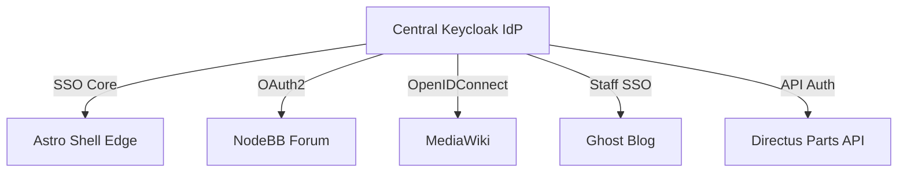

# Stagea Platform: Per-Service Setup & Troubleshooting

This guide provides step-by-step instructions for initial local deployment of each platform submodule, along with troubleshooting protocols for common issues encountered during setup.

---



---

## 1. NodeBB Forum (`forum/`)

NodeBB is our Node.js-based forum engine. It relies on a fast-key backing store (Redis) or database (MongoDB/PostgreSQL).

### Initial Setup Steps
1. **With Docker (Recommended)**:
   Navigate to `/forum` and launch the Compose stack. (Select PostgreSQL or Redis variant):
   ```bash
   cd forum
   docker compose -f docker-compose-redis.yml up -d
   ```
2. **Native Host Setup**:
   If running without Docker, ensure Redis is active on localhost, then run:
   ```bash
   pnpm install
   ./nodebb setup
   # Follow prompt: URL = http://localhost:4567, Database = redis, host = 127.0.0.1
   ./nodebb start
   ```

### Troubleshooting & Setup Gaps
* **Error: `Redis connection to 127.0.0.1:6379 failed`**
  * *Cause*: Local Redis is either offline or blocked by a system password.
  * *Fix*: Verify Redis is active on the host with `redis-cli ping` (should reply `PONG`). If using Docker, ensure the `nodebb` container is on the same Docker bridge network as your `redis` container.
* **Error: `NodeBB Admin creation fails in terminal`**
  * *Cause*: Node version mismatch. NodeBB `master` requires Node.js `20.x` or newer.
  * *Fix*: Check version with `node -v` and use Node 20/22 via `nvm` or `fnm`: `fnm use 20`.

---

## 2. MediaWiki (`wiki/`)

MediaWiki is our PHP/Apache content engine. It requires a MySQL/MariaDB database.

### Initial Setup Steps
1. **Configure Environment Variables**:
   MediaWiki container requires your local Host UID/GID to bind-mount folders cleanly:
   ```bash
   cd wiki
   printf 'MW_DOCKER_UID=%s\nMW_DOCKER_GID=%s\n' "$(id -u)" "$(id -g)" > .env
   docker compose up -d
   ```
2. **Install PHP Dependencies**:
   First boot will return an HTTP 500 error because composer packages are not downloaded:
   ```bash
   docker exec -w /var/www/html/w wiki-mediawiki-1 composer install --no-dev --no-interaction
   ```
3. **Execute Browser Installer**:
   Open [http://localhost:8080/w/mw-config/index.php](http://localhost:8080/w/mw-config/index.php) and follow the installer to configure database details.
4. **Deploy LocalSettings**:
   Download the generated `LocalSettings.php` at the end of the installation and save it into your `/wiki` directory. Restart the container: `docker compose restart`.

### Troubleshooting & Setup Gaps
* **Error: `LocalSettings.php not found` on container reboot**
  * *Cause*: The file was downloaded but not copied into the correct root mount.
  * *Fix*: Ensure `LocalSettings.php` resides in the `/wiki` folder on your host machine (it is bind-mounted directly to `/var/www/html/w/LocalSettings.php` inside the container).
* **Error: `Extension VisualEditor is not loaded`**
  * *Cause*: Extension files are missing or require manual activation.
  * *Fix*: Open your `LocalSettings.php` and append:
    ```php
    wfLoadExtension( 'VisualEditor' );
    ```

---

## 3. Ghost Blog (`blog/`)

Ghost is a fast, Node.js-based headless CMS structured inside a `pnpm` monorepo workspace.

### Initial Setup Steps
1. **Initialize Casper Theme Submodules**:
   ```bash
   cd blog
   git submodule update --init --recursive
   ```
2. **Install Workspace Dependencies**:
   ```bash
   pnpm install --frozen-lockfile
   ```
3. **Start the Port-Conflict Guarded Dev Stack**:
   Use our custom override script to prevent Ghost from overriding standard Redis and Mailpit ports:
   ```bash
   cd ..
   ./infra/blog-dev.sh
   # Serves blog at http://localhost:2368/ and mailpit at http://localhost:18025/
   ```

### Troubleshooting & Setup Gaps
* **Error: `pnpm setup or install fails with node-gyp build failures`**
  * *Cause*: Ghost's sqlite3 dependency requires local compiler tools (GCC/g++ or Xcode tools).
  * *Fix*: Ensure build tools are installed. On macOS, run `xcode-select --install`. On Debian/Ubuntu, run `sudo apt-get install build-essential`.
* **Error: `Nx cache failures during ghost-monorepo build`**
  * *Cause*: Old compilation files exist inside the monorepo cache.
  * *Fix*: Clear the build cache and retry:
    ```bash
    pnpm nx reset
    pnpm install
    ```

---

## 4. Saleor Storefront (`shop/`)

The Saleor storefront is a Next.js web client that queries a Saleor GraphQL API.

### Initial Setup Steps
1. **Set Up Local Envs**:
   Create a local configuration mapping pointing to your GraphQL core:
   ```bash
   cd shop
   cat > .env <<EOF
   NEXT_PUBLIC_SALEOR_API_URL=http://localhost:8000/graphql/
   NEXT_PUBLIC_STOREFRONT_URL=http://localhost:3000
   NEXT_PUBLIC_DEFAULT_CHANNEL=default-channel
   EOF
   ```
2. **Install & Run Storefront**:
   ```bash
   pnpm install --frozen-lockfile
   pnpm dev
   ```

### Troubleshooting & Setup Gaps
* **Error: `GraphQL query returns empty arrays or CORS blocks`**
  * *Cause*: The Saleor API core at `localhost:8000` is either offline, unseeded, or refuses connections from port `3000`.
  * *Fix*: Launch the backend core (`saleor-platform`) and verify that your default channel is seeded. Ensure your browser respects local cookie origins when receiving CORS headers.
* **Error: `Next.js port 3000 already in use`**
  * *Cause*: Another Next/React app is claiming port 3000 on your host.
  * *Fix*: Next.js will automatically fall back to port `3001` or `3002`. Update your `.env` parameter `NEXT_PUBLIC_STOREFRONT_URL` to match the fallback port.

---

## 5. Keycloak SSO (`services/auth/` - Planned)

Keycloak is our OIDC single sign-on provider. It runs as a Java/Quarkus container backed by PostgreSQL.

### Initial Setup Steps
1. **Scaffold Directory & Compose**:
   Create the directory and Compose file:
   ```bash
   mkdir -p services/auth
   ```
2. **Run Keycloak Container**:
   Configure database bindings and administrative credentials:
   ```yaml
   # services/auth/compose.yaml
   services:
     postgres:
       image: postgres:16-alpine
       environment:
         POSTGRES_DB: keycloak
         POSTGRES_USER: keycloak
         POSTGRES_PASSWORD: password
     keycloak:
       image: quay.io/keycloak/keycloak:24.0
       command: start-dev
       environment:
         KC_DB: postgres
         KC_DB_URL: jdbc:postgresql://postgres/keycloak
         KC_DB_USERNAME: keycloak
         KC_DB_PASSWORD: password
         KEYCLOAK_ADMIN: admin
         KEYCLOAK_ADMIN_PASSWORD: admin
       ports:
         - "18080:8080"
   ```

### Troubleshooting & Setup Gaps
* **Error: `Database connection timeouts on boot`**
  * *Cause*: The Keycloak container booted faster than the PostgreSQL database was ready to accept network calls.
  * *Fix*: Add health checks to your database service and use `depends_on` with `condition: service_healthy` on Keycloak.

---

## 6. Directus Parts API (`services/parts-api/` - Planned)

Directus provides our instant parts catalog API and admin back-office, backed by a Postgres database.

### Initial Setup Steps
1. **Scaffold Directory**:
   ```bash
   mkdir -p services/parts-api
   ```
2. **Execute Compose Stack**:
   Launch Directus node on host port `8055`:
   ```yaml
   # services/parts-api/compose.yaml
   services:
     directus:
       image: directus/directus:10.10
       ports:
         - "8055:8055"
       environment:
         KEY: "stagea-secret-key"
         SECRET: "stagea-secret"
         DB_CLIENT: "pg"
         DB_HOST: "postgres"
         DB_PORT: "5432"
         DB_DATABASE: "directus"
         DB_USER: "directus"
         DB_PASSWORD: "password"
   ```

### Troubleshooting & Setup Gaps
* **Error: `API file upload errors (Disk write permissions)`**
  * *Cause*: The Directus container runs under an unprivileged user that lacks write rights to bind-mounted file upload directories on your host.
  * *Fix*: Grant read/write rights to `/uploads` folder on the host: `chmod -R 777 services/parts-api/uploads`.

---

## 🔗 Related Documentation & Compliance References

* 🧭 **[Platform Master Site-Plan](../site-plan.md)** — Overall multi-site architecture, subdomain map, and current monorepo statuses.
* ⭐️ **[System 12-Factor Compliance Audit](../12_factor_compliance.md)** — Comprehensive review of Stagea monorepo compliance with all twelve principles from 12factor.net.
* 🚀 **[Development Stack Deployment Guide](./README.md)** — Entry point for deploying the entire local developer stack and managing port maps.
* 🐳 **[Shell Production Deployment Guide](./shell_deployment.md)** — Detailed specification for staging/production Astro Shell setups (Nginx conf, envs).
