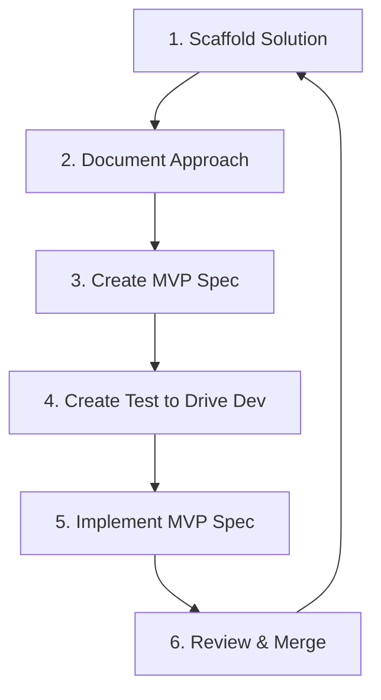

# Stagea Shell — Sprint Roadmap & TODO

This document defines the vertical development slices, core design decisions, and immediate action items for the Astro Shell. We adopt a **Vertical Slicing** philosophy to ensure every change delivers a fully integrated, testable MVP slice rather than an isolated horizontal layer.

---

## 1. The 6-Step Developer Feature Loop

To construct an application of this scale reliably, all new feature additions in the Shell must run through this disciplined engineering loop:



1. **Scaffold**: Create simple, mock-backed routing and layout components in the Shell (`pages/`, `components/`, `lib/`).
2. **Document**: Record the architecture, API contracts, and integration points in the local documentation or inline comments.
3. **MVP Spec**: Formulate a tight, minimal checklist of requirements that constitute a complete user journey.
4. **Test**: Write a local automated unit or integration test (e.g. using Vitest or Playwright) *before* deep implementation to drive requirements.
5. **Implement**: Write the production SSR code, fetch the real backing services, and wire up live claims.
6. **Review**: Audit performance (Lighthouse), 12-factor compliance, and security before declaring the slice done.

---

## 2. Frontend Visuals & UI Component Library Strategy

To maintain absolute brand consistency across our distinct codebases—the Astro Shell, the Next.js Storefront (`shop/`), and various other sub-sites—we must choose a component library strategy that is highly interoperable.

### Technical Baseline
* **CSS Engine**: Tailwind CSS v4 (native in the Shell and highly performant).
* **Interoperability Requirement**: Needs to run in **Astro (HTML/SSR-first)** and **Next.js (React)**.

### Selected Approach: Tailwind CSS v4 + Headless Primitives
We will establish a hybrid UI system that guarantees style sharing with zero runtime duplication:

```
                  ┌───────────────────────────────┐
                  │      Tailwind CSS v4 Spec     │
                  │   Shared Core Theme Tokens    │
                  └──────────────┬────────────────┘
                                 │
         ┌───────────────────────┴───────────────────────┐
         ▼                                               ▼
┌──────────────────────────────┐                ┌──────────────────────────────┐
│       Astro Shell UI         │                │     Next.js Storefront       │
│  SSR HTML + Tailwind Classes │                │    React + Radix Headless    │
│  Zero-JS hydration cost      │                │    Styled with same tokens   │
└──────────────────────────────┘                └──────────────────────────────┘
```

1. **Vanilla HTML/Astro for the Shell Core**: Keep the Shell lightweight and hyper-fast. Buttons, cards, navbars, and forms are authored as plain Astro components styled with our custom Tailwind `@theme` variables (defined in `shell/src/styles/global.css`).
2. **Shadcn / Radix UI for Interactive Dashboards**: Where complex UI states are required (e.g., dialogs, dropdown menus, complex tabs in the User Dashboard/Admin View), we use **Radix Headless Primitives** (or **Melt UI** for Svelte/Astro if needed, but standard React components via `@astrojs/react` are preferred to align with the `shop/` codebase).
3. **Common Theme Contract**: Ensure both Astro and Next.js repositories load the same CSS design tokens for colors (`--color-accent`), rounding, and typography.

---

## 3. Vertical Product Slices (The MVP Roadmap)

---

### Slice A: The User Dashboard MVP

#### 1. Scaffold
* Create `/account/dashboard` page.
* Add user greeting, profile avatar header, and a quick-links grid.

#### 2. Document
* Define session state expectations. The Shell reads secure OIDC cookies, maps Keycloak attributes, and presents profile metadata.

#### 3. MVP Spec
* Display User Name, Email, and Avatar.
* Render "My Services Access" card list showing where the user has active accounts (Forum, Shop).
* Display direct, SSO-authenticated links to change their email/password directly on Keycloak.

#### 4. Test
* Add test checking that `/account/dashboard` redirects to `/account` (login) when no session cookie is present.
* Check that user displayName is successfully rendered on-screen when a mock session is active.

#### 5. Implement
* Write the dashboard SSR code consuming `AuthContext`.

---

### Slice B: The Central Administration Console MVP

#### 1. Scaffold
* Create `/admin` view.
* Add mock access restriction: only visible to users carrying `admin` roles.

#### 2. Document
* Explain how the Admin page uses `hasPermission("shell", "admin")` to block non-global/non-shell administrators.

#### 3. MVP Spec
* **Backing Service Status**: Perform light-weight ping checks (fetch HEAD request) to verify if `FORUM_URL`, `WIKI_URL`, `BLOG_URL`, and `SHOP_URL` are active and responsive.
* **Role Simulation Board**: Integrated directly with our mock authorization context, allowing quick permission diagnostics in local development.

#### 4. Test
* Verify that a user lacking `global-admin` or `shell:admin` role receives an immediate `403 Forbidden` or gets gracefully redirected.

#### 5. Implement
* Add server-side ping checkers and render the status table.

---

### Slice C: Edge Shell Routing & Integration Wrapper

We must cleanly operate all platform services, either embedded/wrapped by the Astro Shell or routed to subdomains.

```
                   ┌──────────────────────────────┐
                   │       Edge Route Ingress     │
                   └──────────────┬───────────────┘
                                  │
         ┌────────────────────────┴───────────────────────┐
         ▼                                               ▼
┌──────────────────────────────┐                ┌──────────────────────────────┐
│  Astro Shell Wrapped Paths   │                │     Subdomain Redirection    │
│  - /                         │                │  - forum.stagea-stuff.com    │
│  - /search (Federated)       │                │  - shop.stagea-stuff.com     │
│  - /account (SSO Hub)        │                │  - wiki.stagea-stuff.com     │
└──────────────────────────────┘                └──────────────────────────────┘
```

#### 1. Scaffold
* Establish path-routing contracts in `Header.astro`.

#### 2. Document
* **The Redirection Strategy**: 
  * Heavy interactive applications (Forum, Wiki, Shop) live on separate subdomains (`forum.stagea-stuff.com`, etc.) to isolate operational loads and prevent session leaks.
  * The Astro Shell integrates these by utilizing unified navbar headers, shared CSS themes, and single sign-on (OIDC cookies).
  * Light-weight content (e.g. blog summaries on the homepage) is *wrapped* by calling Ghost APIs server-side directly in the Shell.

#### 3. MVP Spec
* Add dynamic fallback handling: if the shell is run in development mode, navbar links point to `localhost:port`. In staging/production, they dynamically resolve to their respective subdomains (`forum.stagea-stuff.com`).

#### 4. Test
* Verify that in `production` environment, `FORUM_URL` prints `https://forum.stagea-stuff.com` in the navigation headers.

#### 5. Implement
* Fully bind these settings to our Astro Env Schema.

---

## 4. Itemized Sprint Backlog

- [x] **12-Factor Env Refactor**: Declared environment configurations for all backing submodules inside `astro.config.mjs` and refactored global header navigation.
- [x] **SSO Scoped Permissions Engine**: Created `shell/src/lib/auth.ts` and integrated a visual role-testing console on the `/account` page.
- [x] **Federated Search Engine**: Created `shell/src/lib/search.ts` executing parallel queries and integrated with `/search`.
- [x] **Stateless Containerization**: Created production-ready multi-stage `Dockerfile` and local `docker-compose.yml` wrapper.
- [x] **Task 1: User Dashboard Slice** (Fully Implemented)
  - [x] Scaffold `/account/dashboard` page.
  - [x] Implement secure OIDC-mock session checks and redirections.
  - [x] Implement user session data visualization (showing user details, active claims, and custom avatar).
  - [x] Add OIDC profile self-service links.
- [x] **Task 2: Admin Console Slice** (Fully Implemented)
  - [x] Scaffold `/admin` dashboard restricted to `admin` clearance levels.
  - [x] Implement strict security checks verifying standard members are blocked from `/admin`.
  - [x] Implement parallel, asynchronous backend ping check monitor inside the admin panel.
  - [x] Build a cache-clear simulated command button (mock-demonstrating 12-factor one-off task execution).
- [ ] **Task 3: CSS Theme Token Harmonization**
  - [ ] Document design tokens mapping in `shell/src/styles/global.css`.
  - [ ] Verify that custom Tailwind `@theme` attributes are cleanly referenced by all UI cards on the home page.

---

## 🚀 Next Sprints: Remediation Backlog Cards

We have codified our prioritized remediation plan into standard **PRD Sprint Cards**. Assign these out as single cards for the upcoming sprints:

1. 🔴 **[Sprint Card 1: Local OIDC JWKS Verification](./cards/card_1_jwks_auth.md)** — High-performance token validation inside server memory.
2. 🔴 **[Sprint Card 2: Factor XII Administration Scripts](./cards/card_2_admin_tasks.md)** — Version-controlled database maintenance tasks.
3. 🟡 **[Sprint Card 3: Node.js Graceful SIGTERM Handling](./cards/card_3_sigterm_handler.md)** — Robust connection draining and process disposability.
4. 🟡 **[Sprint Card 4: AJAX Progressive Search Enhancement](./cards/card_4_ajax_search.md)** — Instant, animated in-place search queries.
5. 🔵 **[Sprint Card 5: Astro Link Prefetching](./cards/card_5_link_prefetch.md)** — Speculative client-navigation preloading.
6. 🔵 **[Sprint Card 6: Docker Container Sizing Limits](./cards/card_6_container_limits.md)** — Host resource safety boundaries and RAM caps.

---

## 🔗 Related Documentation & Compliance References

* 🧭 **[Platform Master Site-Plan](../site-plan.md)** — Overall multi-site architecture, subdomain map, and current monorepo statuses.
* ⭐️ **[System 12-Factor Compliance Audit](../12_factor_compliance.md)** — Comprehensive review of Stagea monorepo compliance with all twelve principles from 12factor.net.
* 🐳 **[Shell 12-Factor Implementation Plan](./12_FACTOR_PLAN.md)** — Shell-specific 12-factor operations audit and improvement goals.
* 🚦 **[Shell Quality Readiness Ratings](./READINESS_RATING.md)** — Per-file quality assessments, typescript audits, and production path for the Astro Shell.
* 🔐 **[Shell Scoped Auth Plan](./auth_plan.md)** — Centralized authentication, Keycloak clients, and role hierarchy mappings.
