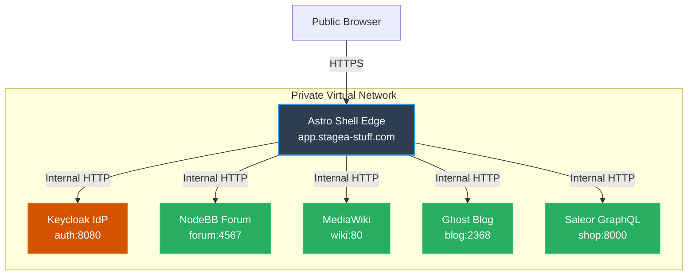
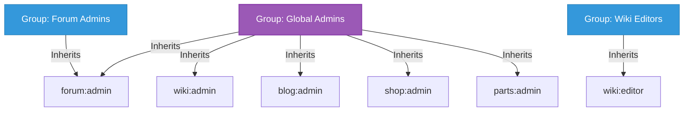

# Stagea Platform: 12-Factor & Insulated Auth Architecture Plan

This document establishes the architecture plan for the Stagea platform to ensure that the Astro shell is 12-factor compatible, the backend services are securely insulated behind the shell edge, and user/admin permissions are scoped cleanly across our diverse submodules using Keycloak.

---

## 1. 12-Factor Compliance Plan (Astro Shell)

The **Astro Shell (`shell/`)** is our edge surface. To ensure it is fully compliant with the [12-Factor App methodology](https://12factor.net/), we implement the following patterns:

```mermaid
flowchart TD
    subgraph Twelve_Factors [12-Factor Methodology]
        direction LR
        C[I. Codebase] --> D[II. Dependencies]
        D --> E[III. Config]
        E --> F[IV. Backing Services]
        F --> G[V. Build, Release, Run]
        G --> H[VI. Processes]
        H --> I[VII. Port Binding]
        I --> J[VIII. Concurrency]
        J --> K[IX. Disposability]
        K --> L[X. Dev/Prod Parity]
        L --> M[XI. Logs]
        M --> N[XII. Admin Processes]
    end
```



| Factor | Principle | Stagea Implementation Strategy |
| :--- | :--- | :--- |
| **I. Codebase** | One codebase tracked in revision control, many deploys | Single git monorepo `stagea-stuff` holding code, configuration, and infra glue. |
| **II. Dependencies** | Explicitly declare and isolate dependencies | Declared in `shell/package.json`, pinned with `shell/pnpm-lock.yaml`. Isolated in multi-stage builds. |
| **III. Config** | Store config in the environment | Handled via **Astro Env Schema** (`astro.config.mjs`). All service URLs and auth credentials are read from OS env variables at request time, falling back to local dev values. |
| **IV. Backing Services** | Treat backing services as attached resources | NodeBB, Ghost, MediaWiki, and Keycloak are treated as attached network resources. The shell connects via URLs mapped in the Config factor. |
| **V. Build, Release, Run**| Strictly separate build and run stages | **Build**: `docker build` compiles the Astro static and SSR files into `/dist`. <br>**Release**: Combines built assets with dynamic environment config.<br>**Run**: Starts a stateless Node process. |
| **VI. Processes** | Execute the app as one or more stateless processes | Astro runs as a share-nothing, stateless node.js process. Session state is stored client-side in secure cookies or a cache store (Redis). |
| **VII. Port Binding** | Export services via port binding | Astro binds directly to port `4321` (or custom `PORT`) within the container, which is exposed to the host or router. |
| **VIII. Concurrency** | Scale out via the process model | Scaling up is as simple as launching more stateless `stagea-shell` containers behind our edge load balancer. |
| **IX. Disposability**| Maximize robustness with fast startup & graceful shutdown | Lightweight Alpine base image ensures fast container startup. Node.js handles standard signaling (e.g. `SIGTERM`) for graceful shutdowns. |
| **X. Dev/Prod Parity**| Keep development, staging, and production as similar as possible | The same Docker container is built, tested in staging, and deployed to production. Only the environment variables (config) change. |
| **XI. Logs** | Treat logs as event streams | Astro and Node.js stream all logs directly to `stdout` and `stderr`. The execution environment collects them (e.g., Loki, Fluentbit). |
| **XII. Admin Processes**| Run admin/management tasks as one-off processes | Administrative tasks (database setup, migrations, user seeding) are run as one-time Docker tasks or CLI wrappers, completely separate from the long-running web process. |

---

## 2. Insulated Backend Pattern (The Edge Surface)

To protect upstream submodules (Forum, Wiki, Blog, Shop, Parts) from direct public exposure, we employ an **Insulated Backend** architecture. The Astro Shell acts as the single public gateway (the "Edge").



### Edge Proxying & Session Exchange
1. **SSO Entry**: Users authenticate at `app.stagea-stuff.com/account` using the OIDC flow mediated by Keycloak.
2. **Session Cookie**: The Astro Shell sets a highly secure, `HttpOnly`, `SameSite=Lax`, encrypted session cookie.
3. **Internal Token Exchange**: When a user makes requests to sub-services (e.g., rendering forum threads, checking shopping carts), the Astro Shell intercepts the request:
   - Validates the session cookie.
   - Extracts/refreshes the OIDC Bearer JWT Token.
   - Appends the JWT in a secure header (e.g., `Authorization: Bearer <JWT>`) when forwarding the request to the internal backend service.
4. **Shielded Services**: Backend submodules run in private Docker networks, refusing external connections and trusting only requests arriving from the Astro Shell or local trusted reverse-proxies.

---

## 3. Account Permissions & Scopes Schema

We centralize identities in Keycloak but scope authorization to individual submodules to maintain service separation.

### Client Identifiers (Keycloak)
A single Keycloak Realm `stagea` is created, containing separate clients for each application:
* `shell-client` (Astro homepage)
* `forum-client` (NodeBB)
* `wiki-client` (MediaWiki)
* `blog-client` (Ghost)
* `shop-client` (Saleor)
* `parts-client` (Directus)

### Scoped Permissions (Roles)
Each client defines its own isolated roles:

```
[Keycloak Realm: stagea]
  ├── Clients
  │     ├── forum-client  ──> Roles: [forum:admin, forum:moderator, forum:user]
  │     ├── wiki-client   ──> Roles: [wiki:admin, wiki:editor, wiki:user]
  │     ├── blog-client   ──> Roles: [blog:admin, blog:author, blog:member]
  │     ├── shop-client   ──> Roles: [shop:admin, shop:staff, shop:customer]
  │     └── parts-client  ──> Roles: [parts:admin, parts:editor, parts:viewer]
```

### Global vs. Per-Subsite Admins (Keycloak Groups)
We leverage Keycloak Groups to allow both global administration and localized delegation:



1. **Global Admins Group (`global-admins`)**:
   * Users in this group automatically inherit the admin role for *every* client (`forum:admin`, `wiki:admin`, `blog:admin`, `shop:admin`, `parts:admin`).
   * This provides full global administrative privileges across all services.
2. **Per-Sub-Site Groups (e.g., `forum-managers`, `wiki-editors`)**:
   * Users in `forum-managers` only receive `forum:admin` or `forum:moderator`. They have zero privileges on the wiki, shop, or blog.
   * Users in `wiki-editors` only receive `wiki:editor`.
   * This keeps operational roles cleanly siloed.

---

## 4. Local Dev & Staging Access to Admin Interfaces

Admin interfaces for sub-sites (like Ghost Admin or NodeBB Control Panel) must remain easily accessible to authorized users in local development and staging environments.

### Local Development Environment (`http://localhost/*`)
* **Ports Exposure**: In development, we expose specific ports on `localhost` (e.g., `2368` for Ghost, `4567` for NodeBB) so admins can access panels directly (e.g., `http://localhost:2368/ghost/`).
* **Dev SSO Bypass / Local Admin**: Each submodule can support a fallback local credentials login (username/password) that is active *only* when the environment is set to `development`, allowing rapid testing without setting up Keycloak locally first.

### Staging Environment (`*.stagea-stuff.dev`)
In staging, services are routed through Nginx subdomains. To protect the admin panels, we implement a two-tiered security approach:

1. **SSO Protection via Reverse Proxy (oauth2-proxy / Keycloak Gatekeeper)**:
   * The reverse-proxy is configured so that requests to sensitive paths (e.g., `/ghost/`, `/admin/`, `Special:SpecialPages`) require an active Keycloak session.
   * Only users belonging to the `global-admins` or respective sub-site admin group are allowed through the proxy to the admin URL.
2. **Submodule Native Integration**:
   * Submodules are configured to parse OIDC headers. When an admin logs in through the SSO gate, the submodule identifies them as an admin and logs them into their administrative session automatically.
3. **Whitelisting & VPN (Optional)**:
   * Staging admin domains (e.g., `admin.stagea-stuff.dev`) can be locked down via Nginx IP-whitelisting to corporate/developer IPs or routed exclusively through a WireGuard VPN.

---

## 5. Next Steps

1. **Scaffold Keycloak (`auth/`)**: Create the Docker Compose stack for Keycloak in `services/auth/` and export the initial `stagea` realm schema containing client registrations.
2. **Implement Astro Auth Middleware**: Add `@auth/core` or `openid-client` inside the Astro Shell to execute the OIDC token exchange and manage session cookies.
3. **Configure Upstream OIDC Plugins**:
   - Install and configure NodeBB's OIDC plugin.
   - Add PluggableAuth and OpenIDConnect extensions to MediaWiki.
   - Configure Ghost OIDC/SSO integration.

---

## 🔗 Related Documentation & Design References

* 🧭 **[Platform Master Site-Plan](../site-plan.md)** — Overall multi-site architecture, subdomain map, and current monorepo statuses.
* ⭐️ **[System 12-Factor Compliance Audit](../12_factor_compliance.md)** — Comprehensive review of Stagea monorepo compliance with all twelve principles from 12factor.net.
* 🐳 **[Shell 12-Factor Implementation Plan](./12_FACTOR_PLAN.md)** — Shell-specific 12-factor operations audit and improvement goals.
* 🚦 **[Shell Quality Readiness Ratings](./READINESS_RATING.md)** — Per-file quality assessments, typescript audits, and production path for the Astro Shell.
* 📋 **[Shell Sprint Backlog & TODO](./TODO.md)** — Active product features backlog and our 6-step vertical loop checklist.
