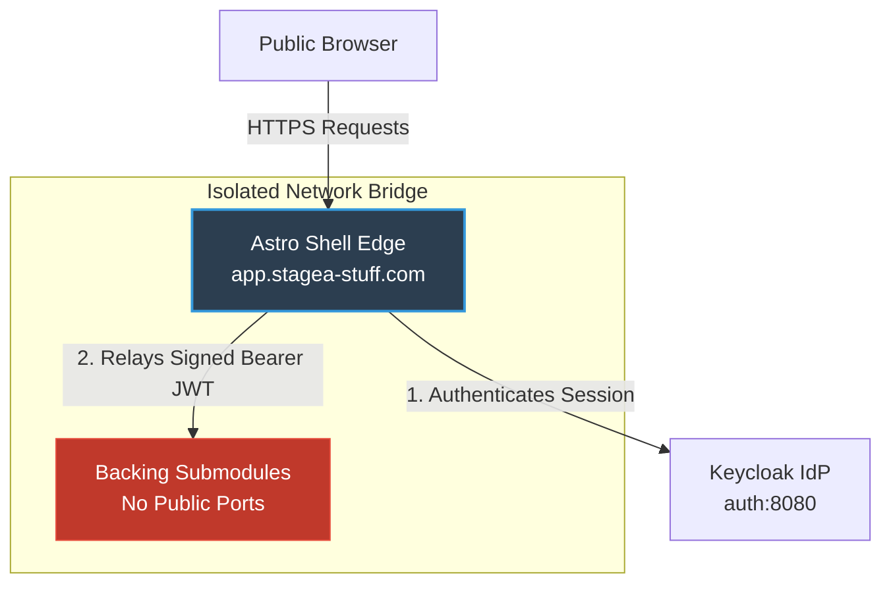

# Astro Shell — Security Architecture & Policy

This document defines the security boundaries, network insulation rules, cryptographic session workflows, and input sanitization policies for the Astro Shell (`shell/`) as the edge gateway for the Stagea platform.

---

## 1. Threat Model & Edge Boundaries

The Astro Shell is the single public-facing gateway ("the Edge"). It is the only service exposed directly to user browsers, acting as an insulating layer that shields our underlying backing submodules (NodeBB, MediaWiki, Ghost, Saleor) from direct public threats.



---

## 2. Authentication & Session Security (OIDC)

Our single sign-on (SSO) and authentication pipelines adhere to strict cryptographic standards:

### Secure Cookie Policy
Sessions between the client browser and the Astro Shell are managed via a stateless cookie (`stagea_session`). In staging and production, this cookie must enforce the following flags:
* **`HttpOnly`**: Set to `true`. This blocks client-side JavaScript from accessing the cookie, completely neutralizing XSS-based session hijacking.
* **`Secure`**: Set to `true`. Enforces that the cookie is only transmitted over encrypted HTTPS connections.
* **`SameSite=Lax`**: Mitigates Cross-Site Request Forgery (CSRF) attacks by restricting cookie transmission on cross-site navigations.
* **`Path=/`**: Restricts cookie scope to the root gateway domain.

### Local Token Verification (JWKS)
To prevent JWT tampering or spoofing, the Astro Shell cryptographically verifies all session tokens locally.
* Public signing keys are retrieved from Keycloak's JSON Web Key Set (JWKS) endpoint (`/protocol/openid-connect/certs`).
* Signing keys are cached locally in server memory with a strict `30-second` cooldown limit to rate-limit outbound key-refresh calls.

---

## 3. Network Isolation & Port Segregation

We enforce strict network segregation to insulate our backend databases and submodules:

1. **Unexposed Container Ports**: Production and staging `docker-compose` stacks must *never* publish host ports for NodeBB, Ghost, MediaWiki, MongoDB, Redis, or PostgreSQL.
2. **Internal Bridge Network**: All container communications are restricted to an isolated internal Docker bridge network (`stagea-net`).
3. **Proxy Validation**: Backing submodules are configured to only trust requests carrying the signed OIDC bearer token or originating from the Astro Shell's internal container IP.

---

## 4. Input Sanitization & Cross-Site Scripting (XSS)

Because the Shell renders content dynamically from multiple backing sources (for example, displaying forum posts or wiki snippets in Federated Search), we must protect against XSS injection:

### Default Astro Escaping
* By default, Astro expression interpolations `{result.snippet}` automatically HTML-escape all values, rendering plain text and neutralizing malicious `<script>` tags.

### Safe HTML Rendering (`set:html`)
* When rendering rich HTML fragments (e.g. search hit snippets highlighted by MediaWiki), developers must use Astro's `set:html` attribute.
* **Security Rule**: `set:html` must *never* receive raw, unsanitized user inputs. All dynamic markup streams must run through a server-side DOM sanitizer (such as `isomorphic-dompurify`) before being rendered into the viewport.
  ```typescript
  import DOMPurify from "isomorphic-dompurify";
  
  // Enforce server-side sanitization before rendering
  const sanitizedSnippet = DOMPurify.sanitize(result.snippet);
  ```

---

## 5. Least-Privilege Container Security

Our production containers are configured to minimize the impact of a potential container-escape exploit:

* **Unprivileged User Execution**: The Astro Shell container explicitly drops root privileges and executes the Node.js process under the unprivileged `node` user (UID/GID `1000:1000`).
* **Read-Only File System**: Production runtimes should run with read-only root filesystems (`read_only: true`), restricting directory writes exclusively to designated temporary directories (`/tmp`, `/app/dist/server/sessions`).

---

## 🔗 Related Documentation & Compliance References

* 🧭 **[Platform Master Site-Plan](../site-plan.md)** — Overall multi-site architecture, subdomain map, and current monorepo statuses.
* ⭐️ **[System 12-Factor Compliance Audit](../12_factor_compliance.md)** — Comprehensive review of Stagea monorepo compliance with all twelve principles from 12factor.net.
* 🚀 **[Development Stack Deployment Guide](../deployment/README.md)** — Entry point for deploying the entire local developer stack and managing port maps.
* 🎨 **[Shell UX & Brand Guidelines](./ux.md)** — Visual standards, loading states, performance metrics, and responsive design guidelines.
